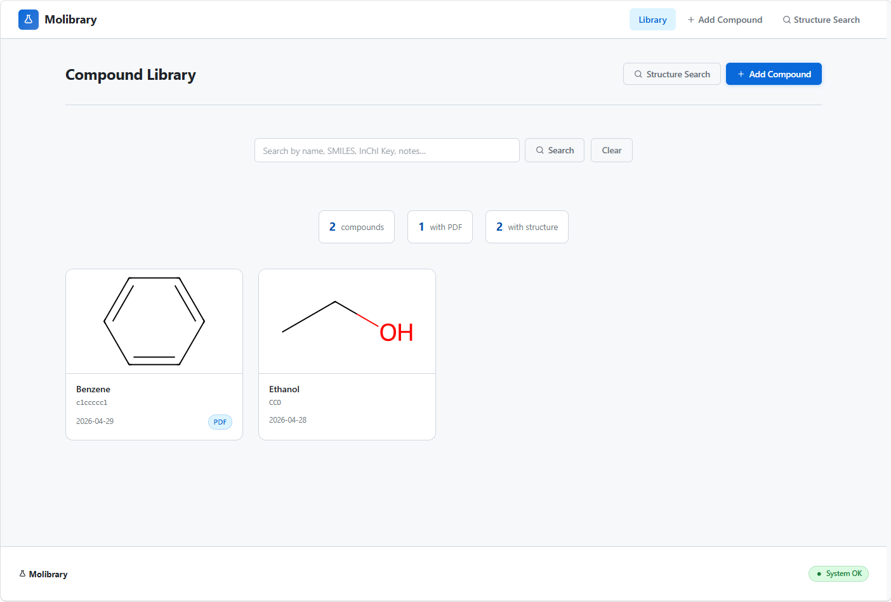

# Molibrary — Local Chemical Structure & Protocol Database

A self-hosted, offline-capable web application for depositing, searching,
and viewing organic chemical structures with linked synthetic protocol PDFs.
Integrates with **MoleditPy** via the bundled plugin.



---

## Quick Start (Windows)

```
1. setup.bat      ← installs Python dependencies + downloads offline editor (run once)
2. start.bat      ← starts the server
3. Open browser   http://127.0.0.1:5000
```

## Quick Start (Linux / macOS)

```bash
chmod +x setup.sh start.sh
./setup.sh        # installs dependencies + downloads offline editor (run once)
./start.sh        # starts the server
# Open http://127.0.0.1:5000
```

---

## Requirements

| Requirement | Version |
|---|---|
| Python | 3.10 or later |
| Internet | **Setup only** — to download `flask`, `rdkit`, and the JSME editor |
| Internet at runtime | **Not required** — fully offline after setup |

---

## Features

### Compound Library
- Card grid with structure thumbnails and PDF badges
- Sort by date added; stats strip shows total / with-PDF / with-structure counts

### Add / Edit Compounds
- **JSME structure editor** — draw molecules directly in the browser (offline after setup)
- **SMILES input** — type or paste; sync to/from the editor in one click
- **Author / Chemist** field — track who added each compound
- **PDF upload** — drag-and-drop or click; supports any filename including non-ASCII
- **Notes** — reaction conditions, yield, observations

### Compound Detail Page
- Structure rendered by RDKit (SVG)
- One-click copy of SMILES and InChI Key
- Open PDF in browser or force-download

### Structure Search
| Mode | Description |
|---|---|
| **Substructure** | Find all compounds containing the drawn query fragment |
| **Similarity** | Tanimoto (Morgan fingerprint) search with adjustable threshold |

### Text / Name Search
Live search bar on the main library page — searches name, SMILES, InChI Key, and notes via `GET /api/compounds?q=`. Results update as you type (280 ms debounce).

---

## Network Access

By default the server binds to **all interfaces** (`0.0.0.0:5000`), so it is
reachable from any device on the same LAN or intranet:

```
http://127.0.0.1:5000       ← this PC
http://192.168.x.x:5000     ← other devices on local network
http://labserver:5000        ← by hostname
```

To restrict to localhost only:

```bat
REM Windows
start.bat --localhost

# Linux / macOS
./start.sh --localhost
```

Custom port:

```
start.bat --port 8080
./start.sh --port 8080
```

---

## MoleditPy Plugin

`molibrary_plugin.py` connects MoleditPy to a running Molibrary server.

**Installation:** copy the file to `~/.moleditpy/plugins/` and reload plugins.
**Menu:** `Database > Molibrary`

### Plugin features
| Feature | Description |
|---|---|
| Text search | Search by name, SMILES, InChI Key, or notes |
| Exact match | InChI Key exact match — finds the same compound regardless of SMILES representation |
| Substructure search | Find fragments of the current molecule |
| Similarity search | Tanimoto search with adjustable threshold |
| Current Molecule | Strips explicit H, generates canonical SMILES, auto-runs exact match search |
| Open in browser | Double-click any result → compound page opens in browser |
| Load into editor | Import selected compound's structure into the MoleditPy 2D editor |
| Intranet support | Configurable server URL (localhost, LAN IP, or hostname); saved in `molibrary_plugin.json` |

---

## File Structure

```
chem_db_web/
├── app.py                       # Flask backend + REST API
├── requirements.txt             # Python dependencies
├── setup.bat / setup.sh         # One-time setup (Windows / Linux)
├── start.bat  / start.sh        # Launch server
├── download_assets.py           # Downloads JSME editor for offline use
├── molibrary_plugin.py        # MoleditPy plugin
├── compounds.db                 # SQLite database (auto-created)
├── pdfs/                        # Uploaded PDF files
├── static/
│   ├── style.css                # Professional dark-theme stylesheet
│   └── jsme/                    # JSME editor files (downloaded by setup)
├── templates/
│   ├── base.html
│   ├── index.html
│   ├── add.html
│   ├── edit.html
│   ├── compound.html
│   ├── search.html
│   └── editor_snippet.html
└── tests/
    ├── conftest.py
    └── test_app.py              # 46 pytest tests
```

---

## API Reference

| Method | Endpoint | Description |
|---|---|---|
| `GET` | `/api/structure.svg?smiles=…&w=…&h=…` | RDKit SVG rendering |
| `GET` | `/api/compounds?q=…` | Text search (name, SMILES, InChI Key, notes) |
| `POST` | `/api/search` | Structure search (substructure / similarity) |
| `GET` | `/pdf/<filename>` | View PDF in browser |
| `GET` | `/pdf/<filename>/download` | Force-download PDF |

**Structure search body:**
```json
{
  "smiles": "c1ccccc1",
  "mode": "substructure",
  "threshold": 0.5
}
```
`mode` values: `"exact"` (InChI Key match) | `"substructure"` | `"similarity"` (`threshold` used only for similarity).

---

## Production Deployment

`start.bat` / `start.sh` use Flask's built-in development server — **not suitable for production**.
For a stable, always-on deployment use a proper WSGI server.

### Windows — Waitress

```bat
pip install waitress
waitress-serve --host=0.0.0.0 --port=5000 app:app
```

To run as a background service, wrap with [NSSM](https://nssm.cc):

```bat
nssm install Molibrary "C:\path\to\venv\Scripts\waitress-serve.exe" --host=0.0.0.0 --port=5000 app:app
nssm set Molibrary AppDirectory C:\path\to\chem_db_web
nssm start Molibrary
```

### Linux — Gunicorn + systemd

```bash
pip install gunicorn

# /etc/systemd/system/molibrary.service
[Unit]
Description=Molibrary
After=network.target

[Service]
User=youruser
WorkingDirectory=/opt/molibrary/chem_db_web
ExecStart=/opt/molibrary/venv/bin/gunicorn -w 2 -b 0.0.0.0:5000 app:app
Restart=on-failure

[Install]
WantedBy=multi-user.target
```

```bash
systemctl daemon-reload
systemctl enable --now molibrary
```

### Nginx reverse proxy (recommended for LAN/intranet)

```nginx
server {
    listen 80;
    server_name labserver;          # or IP address

    client_max_body_size 60M;       # must be >= app MAX_CONTENT_LENGTH (50 MB)

    location / {
        proxy_pass         http://127.0.0.1:5000;
        proxy_set_header   Host $host;
        proxy_set_header   X-Real-IP $remote_addr;
    }

    location /pdfs/ {
        alias /opt/molibrary/chem_db_web/pdfs/;
    }
}
```

### Notes
- `compounds.db` and `pdfs/` must be **writable** by the server process user.
- The app already runs with `debug=False` — do not change this in production.
- SQLite is suitable for a single-lab workgroup (concurrent reads fine; writes serialised). For high write concurrency migrate to PostgreSQL.
- Back up `compounds.db` + `pdfs/` regularly — that is the entire state of the app.

---

## Running Tests

```bash
cd chem_db_web
pytest tests/ -v
```

CI runs automatically on every push via `.github/workflows/test.yml`.

---

## Database Backup

The entire database is two items:
```
compounds.db    ← all compound metadata, SMILES, InChI Keys
pdfs/           ← all attached PDF files
```
Copy both to back up or migrate to another machine.

---

## Technology Stack

| Component | Library |
|---|---|
| Backend | Flask 3 |
| Chemistry | RDKit — SVG rendering, substructure & similarity search, InChI Key |
| Structure editor | JSME (served locally after setup) |
| Database | SQLite |
| CI | GitHub Actions |
